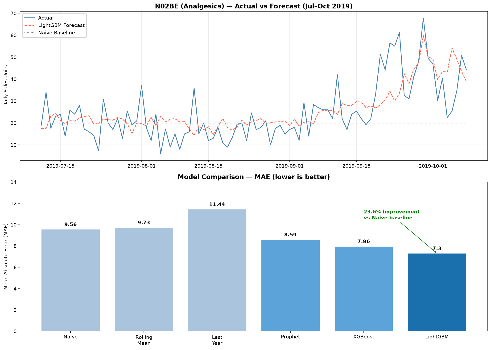

# Pharmaceutical Demand Forecasting

> **Business problem:** A pharmacy chain needs to predict daily drug demand by category to optimize inventory — minimizing stockouts (lost sales, patients without medication) and overstock (tied-up capital, expired products).

## Results

| Model | MAE | RMSE | MAPE |
|---|---|---|---|
| Naive Baseline | 9.56 | 13.98 | 38.5% |
| Rolling Mean | 9.73 | 14.39 | 37.3% |
| Prophet | 8.59 | 10.32 | 46.2% |
| XGBoost | 7.96 | 10.01 | 40.0% |
| **LightGBM** ⭐ | **7.30** | **9.73** | **37.0%** |

**LightGBM achieves 23.6% lower MAE vs naive baseline** — translating to ~6,700 unit-days of improved forecast accuracy per year across all drug categories.



## Key Business Insights

- **Seasonality is strong and predictable:** Analgesics peak Jan/Feb (+80% vs summer), Respiratory drugs follow flu season, Antihistamines peak Apr-Jun. Inventory orders should be placed 4-6 weeks before seasonal peaks.
- **Anxiolytics show structural decline:** ~35% drop from 2014-2019, likely from prescribing guideline changes. Static reorder rules will cause overstock — trend-aware forecasting is essential.
- **ML beats heuristics:** Lag features (7-day, 30-day) and calendar features (month, day-of-week) capture both short-term patterns and seasonal structure.

## Project Structure
## How to Run

```bash
git clone https://github.com/Lakog9/pharma-demand-forecasting
cd pharma-demand-forecasting
python -m venv venv && source venv/bin/activate
pip install -r requirements.txt
# Download dataset from: https://www.kaggle.com/datasets/milanzdravkovic/pharma-sales-data
# Place CSVs in data/
jupyter notebook
```

## Data Source

[Pharma Sales Data](https://www.kaggle.com/datasets/milanzdravkovic/pharma-sales-data) — Milan Zdravković. 6 years (2014-2019), 57 drugs, 8 ATC categories. License: CC BY-NC 4.0.
